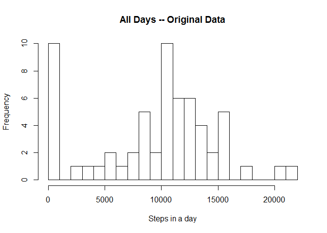
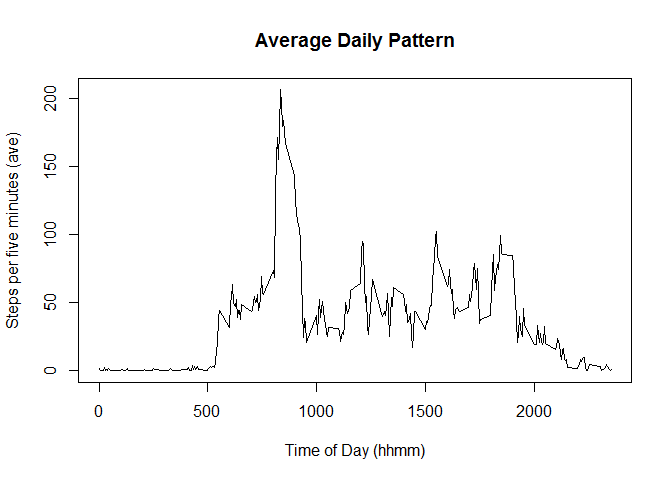
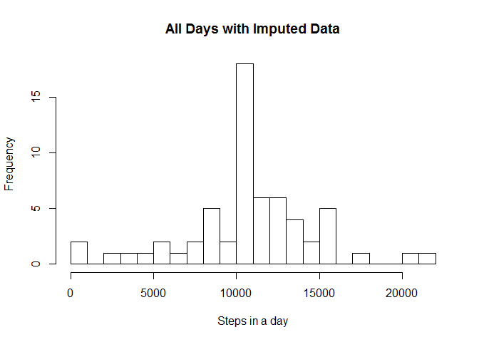
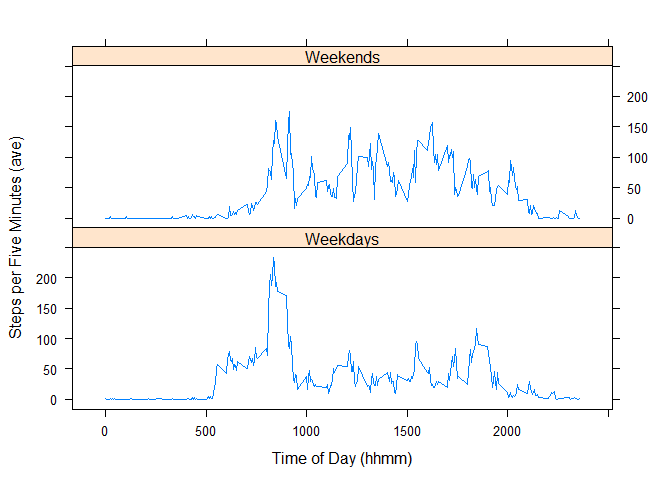

# Reproducible Research: Peer Assessment 1
=======================================================================================

This data set describes the walking (exercise) pattern of one individual
over a two month period. 

**Preliminary observations:**  The subject walks most between 8:00 am and 10:00 am.  The subject's walking is more concentrated on weekdays than weekends, but the total distance walked is greater on weekends.  Weekends are more consistent than weekdays (and start later).

Part of the exercise is imputation of missing data values.  The missing data intervals are spectacularly, even suspiciously, uniform.  That analysis is not included here.  Nevertheless, we impute the missing data according to assumptions described below.
 
 
# Loading and preprocessing the data


```r
if(!file.exists("data")) dir.create("data")
fileUrl = "https://d396qusza40orc.cloudfront.net/repdata/data/activity.zip "
dataDir <- "./data"
zipFile = paste(dataDir, "activity.zip", sep = "/")
download.file(fileUrl, zipFile, mode="wb")
dateDownloaded = date()

unzip(zipFile, exdir = dataDir)

csvFiles <- paste(dataDir, list.files(dataDir, pattern = "\\.csv$"), sep = "/")
activity = read.csv(csvFiles, 
        stringsAsFactors = TRUE,
        row.names = NULL,
        na.strings = "NA",
        col.names = c("steps", "date", "interval"))

activity$date <- as.Date(activity$date, format = "%Y-%m-%d")

if(!file.exists("figurez")) dir.create("figurez")
figDir <- "./figurez/"

suppressPackageStartupMessages(library(plyr))
suppressPackageStartupMessages(library(dplyr))
suppressPackageStartupMessages(library(lattice))
suppressPackageStartupMessages(library(knitr))
opts_chunk$set(fig.path = figDir)
```


# What is mean total number of steps taken per day?
**Boundary conditions:**  288 intervals per day (data formatted hhmm). 
A step = 1/2 pace; 1000 paces for mile (2000 steps per mile).  
An observation must be a natural number &#x2115;<sup>0</sup>.  
Five miles per day would be be healthy.  Twenty-six would be exceptional.  There are no outlying data.  

```r
activity %>% group_by(date) %>% summarise(stepsum = sum(steps , na.rm = TRUE)) %>%
        with(hist(stepsum, main = "All Days -- Original Data", breaks = 30, 
        xlab = paste("Steps in a day")))
```

 

```r
# Calculate mean and median for unaltered data set
activity %>% group_by(date) %>% summarise(stepsum = sum(steps , na.rm = TRUE)) %>%
        summarise_each(funs(mean(.,na.rm = TRUE), 
                            median(.,na.rm = TRUE),
                            sd(.,na.rm = TRUE)), stepsum)
```

```
## Source: local data frame [1 x 3]
## 
##      mean median       sd
##     (dbl)  (int)    (dbl)
## 1 9354.23  10395 5405.895
```

# What is the average daily activity pattern?
**Boundary conditions:** Strides per five minutes: Average walk 400; Brisk walk 600; Marathoner 900 (stride length doubles).  There is no outlying data.  

```r
activity %>% group_by(interval) %>% 
        summarise(meansteps = mean(steps, na.rm = TRUE)) %>%
        with(plot(interval, meansteps, type = "l",
                main = "Average Daily Pattern",
                xlab = "Time of Day (hhmm)", 
                ylab = "Steps per five minutes (ave)")
             )
```

 

```r
# Calculate average steps per interval 
activity %>% group_by(interval) %>% summarise(mean(steps, na.rm = TRUE)) ->  meanStepsM

# Determine peak interval
peak <- max(meanStepsM[,2])
peakRow <-subset(meanStepsM, meanStepsM[, 2] == peak)
pHour = as.character(peakRow[1,1])
if (length(pHour) < 4) pHour = paste("0", pHour,sep = "")
pTime <- paste(substr(pHour, 1, 2), ":", substr(pHour,3,4), sep = "")
print(paste("Peak five-minute period on average, all days, at time ", pTime, "  steps ", peak))
```

```
## [1] "Peak five-minute period on average, all days, at time  08:35   steps  206.169811320755"
```


# Imputing missing values
Approximately 15% of the observations in the study are NA.  These values appeared in calendar-day blocks. Weekends and weekdays had approximately the same rate of missing values (within 10%).  
**Assumption:**  A missing value is the same as the average value for the corresponding time interval for the duration of the observation period.
NA values are randomly spread through the data (inconsistent with this data).  
**Item Imputation:** For each NA in the data set, we made item replacement by the average value for that time interval rounded to an integer value.  
**Result:**  Imputation by the selected method reduced the apparent difference between distance walked on weekend versus weekdays.  It increased the modal number of steps per day.  

```r
# Count number of missing observations
print(paste("Number NA values in data set is", sum(is.na(activity$steps)), "of", nrow(activity)))
```

```
## [1] "Number NA values in data set is 2304 of 17568"
```

```r
# Use previously calculated average steps per interval 

aM <- activity  # aM is a dataframe with imputed values
for(i in 1:288) {
        intervalT = meanStepsM[[i,1]]
        aM[aM$interval == intervalT & is.na(aM$steps), 1] <- as.integer(round(meanStepsM[[i,2]]))
        }

aM %>% group_by(date) %>% summarise(stepsum = sum(steps , na.rm = TRUE)) %>%
        with(hist(stepsum, main = "All Days with Imputed Data", breaks = 30,
        xlab = "Steps in a day"))
```

 

```r
aM %>% group_by(date) %>% summarise(stepsum = sum(steps , na.rm = TRUE)) %>%
        summarise_each(funs(mean(.,na.rm = TRUE), 
                            median(.,na.rm = TRUE),
                            sd(.,na.rm = TRUE)), stepsum)
```

```
## Source: local data frame [1 x 3]
## 
##       mean median       sd
##      (dbl)  (int)    (dbl)
## 1 10765.64  10762 3974.391
```


# Are there differences in activity patterns between weekdays and weekends?
Properly, this question should be investigated before and after looking at NA values.  It is possible that day of week is a confounder.  That is, NA values may be correlated with the day of the week.  
**Observations:**  The subject walks most between 8:00 am and 10:00 am.  The subject's walking is more concentrated on weekdays than weekends, but the total distance walked is greater on weekends.  Weekends are more consistent than weekdays (and start later).  


```r
activity %>% 
        mutate(weekend = (weekdays(date) %in% c("Saturday", "Sunday")))  %>%
        mutate(meansteps = 999) %>%
        group_by(weekend, interval) %>%
        summarise(meansteps = as.integer(mean(steps, na.rm = TRUE))) %>%
        group_by(weekend) -> foo

foo<-data.frame(weekend = foo[, 1],
                interval= foo[, 2],
                meansteps=foo[, 3])


f <- factor(foo$weekend, labels = c("Weekdays", "Weekends"))
xyplot(meansteps ~ interval | f, data = foo,
                                 type = "l",
                                 pch = 20,
                                 layout = c(1,2), 
                                 xlab = "Time of Day (hhmm)",
                                 ylab =  "Steps per Five Minutes (ave)")
```

 


